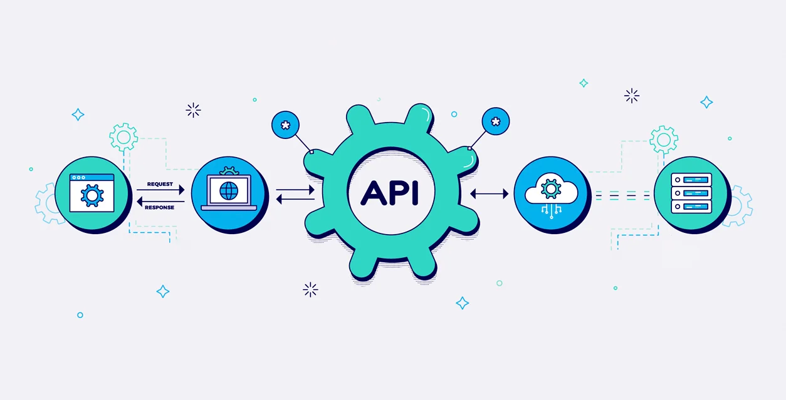
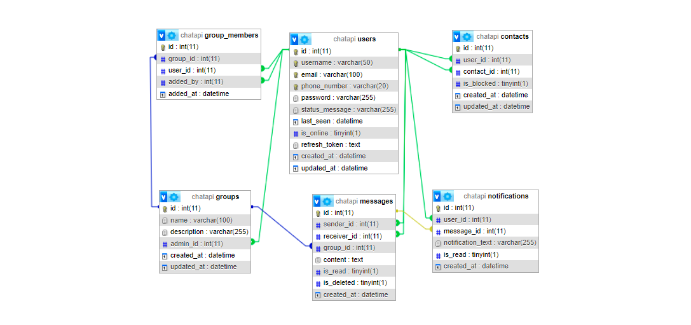

<div align="center">

# API RealmChat
</div>

### Descripción General.
**RealmChat** es una API de mensajería en tiempo real que permite la comunicación fluida entre usuarios a través de un sistema de chat. Esta API está diseñada para facilitar la creación de aplicaciones de mensajería, ofreciendo características robustas para la gestión de usuarios, mensajes, grupos y notificaciones.

[](https://miguel-antonio-martinez-jimenez.github.io/RealmChat/)

<div align="center">
   
   El proyecto no tiene una vista previa de la API...
</div>

## Objetivo.
El objetivo de **RealmChat** es proporcionar a los desarrolladores una solución integral para implementar capacidades de mensajería en sus aplicaciones, permitiendo la interacción en tiempo real y una experiencia de usuario optimizada.

## Características Principales.
- **Registro y Autenticación**: Permite a los usuarios registrarse y autenticarse de manera segura.
- **Envío y Recepción de Mensajes**: Facilita el envío y la recepción de mensajes en tiempo real.
- **Gestión de Grupos**: Los usuarios pueden crear y gestionar grupos de chat.
- **Notificaciones**: Los usuarios reciben notificaciones de nuevos mensajes y actualizaciones.
- **Estado de Conexión**: Indica si un usuario está en línea o desconectado.
- **Bloqueo de Usuarios**: Permite a los usuarios bloquear a otros usuarios.

## Requisitos del Proyecto.
- **Hardware:**
  - Un servidor que soporte Node.js.
- **Software:**
  - Node.js: Versión 14 o superior.
  - Base de Datos: MySQL (requerido por mysql2 y sequelize).
- **Dependencias:**
  - bcrypt: Para el hash de contraseñas.
  - body-parser: Para parsear cuerpos de solicitudes.
  - cors: Para habilitar CORS en la API.
  - dotenv: Para cargar variables de entorno desde un archivo .env.
  - express: Framework web para crear la API.
  - jsonwebtoken: Para la gestión de tokens JWT y autenticación.
  - mysql2: Cliente MySQL para Node.js.
  - sequelize: ORM para facilitar la interacción con la base de datos.
- **Para el desarrollo y pruebas:**
  - chai: Librería de aserciones para pruebas.
  - chai-http: Para realizar solicitudes HTTP en pruebas.
  - jest: Framework de pruebas para JavaScript.
  - mocha: Framework de pruebas para Node.js.
  - nodemon: Herramienta que reinicia automáticamente el servidor al detectar cambios en el código.
  - sequelize-test-helpers: Ayuda en la realización de pruebas para Sequelize.
  - supertest: Para realizar pruebas de integración de API.
- **Scripts:**
  - **Inicio del servidor:**
  - npm start: Ejecuta el servidor utilizando Node.js.
- **Desarrollo:**
  - npm run dev: Ejecuta el servidor utilizando Nodemon.
- **Pruebas:**
  - npm test: Ejecuta las pruebas utilizando Jest.
> [!Important]
> Es importante asegurarse de que todos los requisitos estén instalados y configurados correctamente antes de ejecutar este proyecto para evitar problemas y asegurar un funcionamiento óptimo.

## Tecnologías Utilizadas.
- **Node.js**:Entorno de ejecución para JavaScript en el lado del servidor.
- **Express.js**: Framework web para construir APIs de forma rápida y sencilla.
- **Sequelize**: ORM para gestionar la base de datos MySQL de forma eficiente.
- **MySQL**: Sistema de gestión de bases de datos relacional utilizado para almacenar datos de usuarios, mensajes y notificaciones.
- **JWT (JSON Web Tokens)**: Para la autenticación y autorización de usuarios.
- **Bcrypt**: Para la encriptación de contraseñas.
- **Mocha y Jest**: Para pruebas unitarias y de integración.
- **Nodemon**: Para el desarrollo, reiniciando automáticamente el servidor al detectar cambios en el código.

## Guía de Instalación.
1. Clonación del Repositorio: Clona el repositorio del proyecto desde GitHub o descarga el archivo ZIP.

   ```bash
   git clone https://github.com/Miguel-Antonio-Martinez-Jimenez/RealmChat.git
2. Accede a la carpeta del proyecto que has clonado.
3. Asegúrate de tener Node.js instalado.
4. Navega a la carpeta del proyecto (donde se encuentra el archivo package.json) y ejecuta:
    ```bash
    npm install
- Este comando instalará todas las dependencias necesarias que se enumeran en el archivo package.json.

## Configuración Inicial.
1. Instalar los requisitos del proyecto.
2. **Crear Base de Datos**: Asegúrate de tener MySQL corriendo y crea la base de datos utilizando:

     ```bash
     CREATE DATABASE chatapi;
  - al ejecutar el sistema se crearan las tablas automaticamente...
3. Configurar el archivo `.env` para poder realizar la conexión.

## Conexión con la Base de Datos.
La conexión a la base de datos se establece en el archivo de configuración `db.config.js`. Aquí está un ejemplo de cómo podría lucir:

    const Sequelize = require('sequelize');
    const dotenv = require('dotenv');
    
    dotenv.config();
    
    const sequelize = new Sequelize(
    process.env.DB_NAME,
    process.env.DB_USER,
    process.env.DB_PASSWORD,
    {
      host: process.env.DB_HOST,
      dialect: 'mysql',
      logging: false,
    });

    module.exports = sequelize;

## Diagrama Entidad-Relacion


## Acceso o Credenciales.
El proyecto no requiere acceso o credenciales específicas, ya que es una aplicación de cliente sin autenticación de usuario.

## Guía de Uso del Proyecto.
1. **Inicio del Servidor**
- Para iniciar el servidor, asegúrate de que todas las dependencias estén instaladas y la base de datos esté configurada correctamente.
- Navega a la carpeta del proyecto y ejecuta el siguiente comando:

  ```bash
  npm start
- Para un desarrollo más fluido, puedes utilizar Nodemon, que reiniciará automáticamente el servidor al detectar cambios

  ```bash
  npm run dev
2. **Registro de Usuarios**
- Para registrar un nuevo usuario, envía una solicitud POST a la siguiente ruta:

  ```bash
  POST /auth/register
- **Cuerpo de la Solicitud**:

  ```bash
  {
    "username": "nombre_de_usuario",
    "email": "correo@ejemplo.com",
    "password": "tu_contraseña"
  }
3. **Autenticación de Usuarios**
- Para iniciar sesión, envía una solicitud POST a:

  ```bash
  POST /auth/login
- Cuerpo de la Solicitud:
  
  ```bash
  {
    "email": "correo@ejemplo.com",
    "password": "tu_contraseña"
  }
- Si la autenticación es exitosa, recibirás un token JWT que deberás usar para las solicitudes autenticadas.

## Estructura del Proyecto.
- Estructura del proyecto **Climate Weather**

  ```bash
  Climate_Weather/
  │
  ├── css/
  │   └── style.css
  ├── js/
  │   └── script.js
  ├── index.html
  ├── LICENSE
  └── README.md


## API.
- Este proyecto implementa una API RESTful para gestionar la autenticación de usuarios, contactos y grupos. Aquí tienes un resumen de los endpoints más importantes:
- **Propósito**: Proveer un sistema para gestionar usuarios, contactos y grupos mediante operaciones CRUD (Crear, Leer, Actualizar, Eliminar).
- **Endpoints Principales**:
  - **Autenticación**: Registro, inicio y cierre de sesión de usuarios.
  - **Contactos**: Agregar, obtener y eliminar contactos.
  - **Grupos**: Crear grupos, obtener grupos y sus miembros, y editar grupos.

## Contribuciónes.
> [!Tip]
> Si deseas contribuir al proyecto, reportar errores o proponer mejoras, te invitamos a abrir un pull request o issue en el repositorio. También puedes contactarme directamente para compartir tus ideas o sugerencias a través de mi correo electrónico miguelantoniomartinezjimenez00@gmail.com. ¡Toda colaboración es bienvenida!

## Estado del Proyecto.
**Estado Actual:** `En Desarrollo`
> [!Note]
> Este proyecto se encuentra en estado **En Desarrollo**, lo que significa que el proyecto está en plena fase de desarrollo, con funcionalidades siendo añadidas y pruebas en curso. Puede contener errores o estar sujeto a cambios importantes.

## Testeo.
- **Pruebas Automatizadas**: Se utilizan pruebas unitarias para validar el comportamiento esperado de cada endpoint y asegurar la integridad del sistema.
- **Framework**: Utiliza supertest para simular solicitudes HTTP y verificar respuestas.

## Despliegue.
- **Implementación**: El despliegue de la API se realiza en un entorno adecuado para que los usuarios puedan interactuar con ella, normalmente en un servidor o servicio en la nube.
 
## Problemas Conocidos y Limitaciones.
- **Errores**: Gestión de errores en la autenticación y operaciones de contacto/grupo.
- **Limitaciones**: Posibles restricciones en la cantidad de contactos o grupos que un usuario puede manejar.

## Versiones.
- **Version Actual**: v3.4.

## Actualizaciones.
- **Mejoras en Autenticación**: Implementación de un sistema de autenticación más robusto utilizando JWT para asegurar la comunicación entre el cliente y el servidor.
- **Endpoints Adicionales**: Nuevos endpoints para la gestión de grupos, permitiendo la creación y modificación de grupos y la adición de miembros.
- **Validaciones Mejoradas**: Se han añadido validaciones en los datos de entrada para garantizar que los usuarios proporcionen información correcta y completa al realizar operaciones CRUD.
- **Pruebas Automatizadas**: Se han añadido más pruebas unitarias para garantizar la estabilidad de las nuevas funcionalidades y detectar posibles errores antes de su despliegue.

## Autores.
[MiguelMartinez30 - @DevDarkSonic](https://github.com/Miguel-Antonio-Martinez-Jimenez)

## Licencia.
Este proyecto está licenciado bajo la Licencia MIT. Consulta el archivo LICENSE para más detalles.
